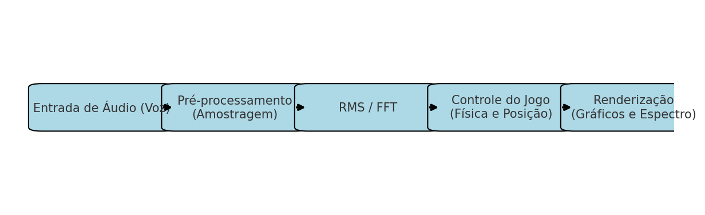
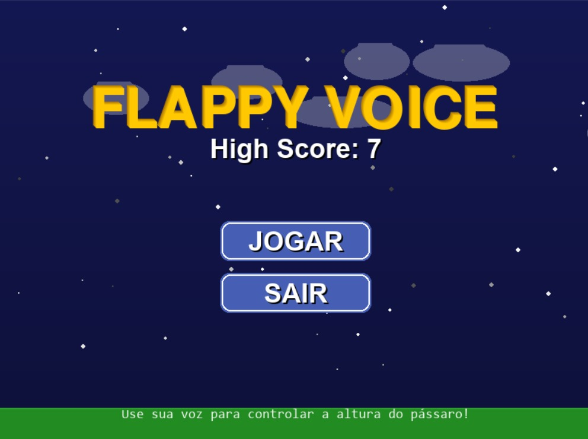

# 🎮 Flappy Voice - Controle de Jogo com Altura Vocal

Este projeto é uma aplicação interativa desenvolvida na disciplina de **Sinais e Sistemas**, que utiliza a **intensidade vocal do jogador** para controlar a altura de um personagem em um jogo estilo "flappy bird".

Desenvolvido por alunos de Engenharia de Computação do CEFET-MG.

---

## 🧠 Conceitos Utilizados

- **RMS (Root Mean Square)** para medir a intensidade da voz.
- **FFT (Transformada Rápida de Fourier)** para visualização espectral do áudio.
- **Controle por sinal analógico (voz)** como entrada em tempo real.
- **Processamento digital de sinais** com Python.
- **Elementos gráficos vetoriais**, partículas, interface em camadas.

---

## 🛠️ Tecnologias e Bibliotecas

- `Python 3`
- `pygame` - Interface gráfica e lógica de jogo
- `numpy` - Cálculo de RMS e FFT
- `sounddevice` - Captura de áudio em tempo real
- `json` e `math` - Para controle de highscore e lógica de física/ângulo

---

## 📦 Instalação

1. Clone o repositório:
```bash
git clone https://github.com/adrianpaivaa/TrabalhoFinal-Sinais.git
cd TrabalhoFinal-Sinais
```

2. Instale as dependências:
```bash
pip install -r requisitos.txt
```

Ou manualmente:
```bash
pip install pygame numpy sounddevice
```

---

## ▶️ Como Jogar

Execute com:
```bash
python jogo.py
```

### Requisitos:
- Microfone funcional
- Ambiente com pouco ruído
- Python 3.8+ e bibliotecas instaladas

---

## 🎯 Funcionamento

- O jogador controla um pássaro animado, que sobe com a força da voz.
- Obstáculos aparecem lateralmente e devem ser evitados.
- Partículas visuais e espectrômetro em tempo real tornam a experiência mais rica.
- Sistema de **menu inicial**, **game over** e **highscore** com persistência em `highscore.json`.

---

## 📊 Diagrama de Fluxo

O diagrama abaixo representa o fluxo principal de funcionamento do sistema:




## 📸 Imagens

### Interface do menu do jogo:


### Interface do jogo em execução:


### Visualização do espectro de áudio (FFT):


---

## 📄 Documentação Técnica

Para mais detalhes sobre a fundamentação teórica, metodologia e resultados, acesse o PDF do artigo:

📄 [`Artigo_Sinais_IEEE.pdf`](./Artigo_Sinais_IEEE.pdf)

---

## 👥 Autores

- Ádrian Henrique de Abreu Paiva  
- Bruno Prado dos Santos  
- Eduardo Henrique Queiroz Almeida  
- João Francisco Teles da Silva  
- Heitor Francisco Costa Xavier

---

## 🔧 Possíveis Melhorias Futuras

- Implementar filtros digitais para ruído ambiente
- Adicionar calibração automática do microfone
- Explorar controle por frequência dominante (e não apenas volume)
- Suporte multiplataforma com configuração de microfone personalizada

---

> Projeto desenvolvido para fins educacionais no CEFET-MG (2025).
